# Autonomous AI Agent — Complete System Guide

> A FastAPI-based autonomous agent that accepts natural language requests, plans tasks, executes them with retry & fallback, and delivers a polished `.docx` document.

---

## Table of Contents

1. [System Overview](#1-system-overview)
2. [Directory Structure](#2-directory-structure)
3. [Request Lifecycle (End-to-End)](#3-request-lifecycle)
4. [Data Models](#4-data-models)
5. [Conversation Memory](#5-conversation-memory)
6. [Planner — Task Decomposition](#6-planner)
7. [Executor — Task Execution with Retry](#7-executor)
8. [Orchestrator — The Core Loop](#8-orchestrator)
9. [LLM Client Layer](#9-llm-client-layer)
10. [Document Builder — .docx Generation](#10-document-builder)
11. [FastAPI Routes](#11-fastapi-routes)
12. [Running the System](#12-running-the-system)
13. [Complete State Visualization (Walkthrough)](#13-complete-state-visualization-walkthrough)
14. [Two Test Inputs](#14-two-test-inputs)
15. [Complete File Reference](#15-complete-file-reference)

---

## 1. System Overview

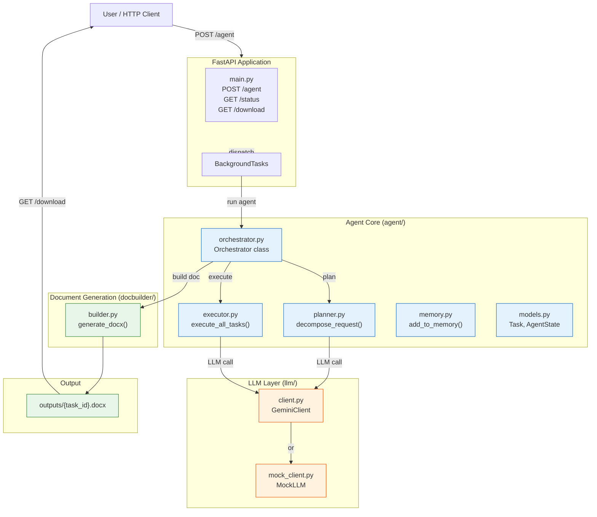

---

## 2. Directory Structure

```
.
├── agent/                          # Core agent logic
│   ├── __init__.py
│   ├── models.py                   # Task, TaskStatus, AgentState
│   ├── memory.py                   # Conversation memory (sliding window)
│   ├── planner.py                  # LLM-based task decomposition + fallback
│   ├── executor.py                 # Task execution with retry & recovery
│   └── orchestrator.py             # Plan → Execute → Build loop
├── llm/                            # LLM abstraction layer
│   ├── __init__.py
│   ├── client.py                   # GeminiClient (real LLM)
│   └── mock_client.py              # MockLLM (testing, no API key)
├── docbuilder/                     # Word document generation
│   ├── __init__.py
│   └── builder.py                  # Markdown → .docx converter
├── outputs/                        # Generated .docx files
├── main.py                         # FastAPI app (routes)
├── requirements.txt                # Python dependencies
└── .env.example                    # GOOGLE_API_KEY config
```

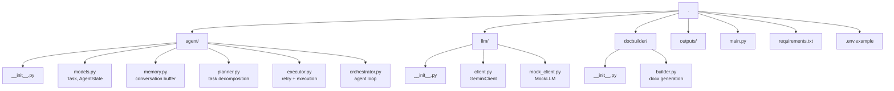

---

## 3. Request Lifecycle

### State Machine

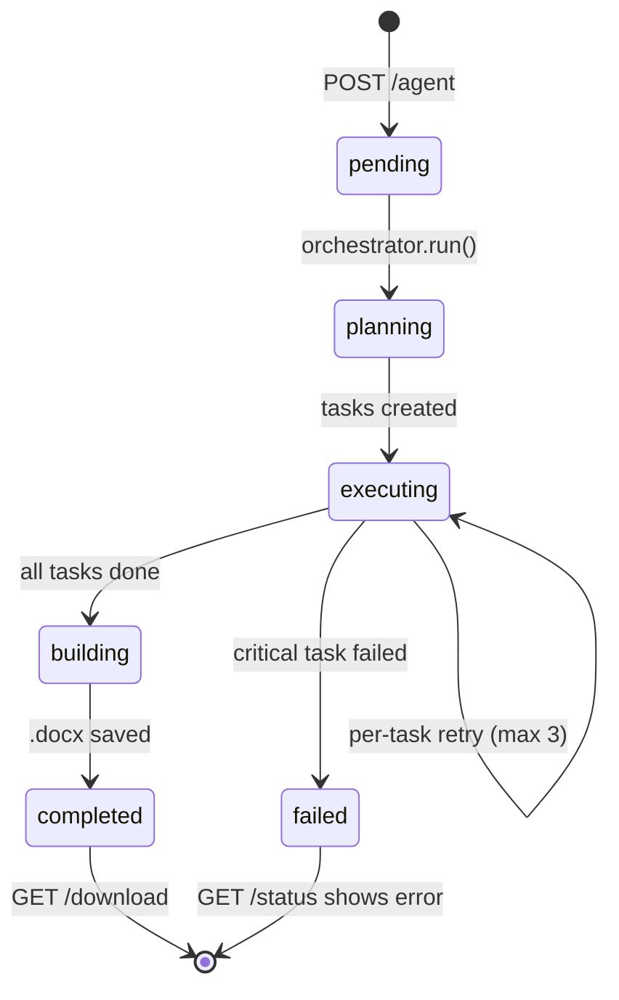

### Full Sequence

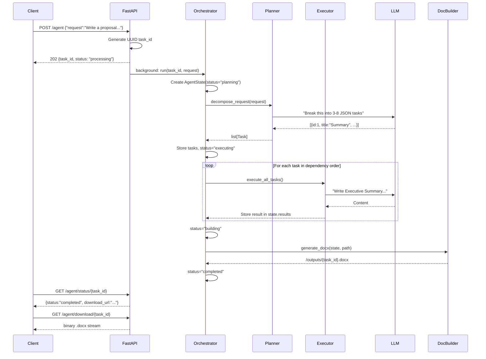

---

## 4. Data Models

**File:** `agent/models.py`

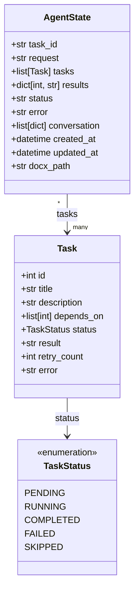

### Code:

```python
from __future__ import annotations

import uuid
from datetime import datetime
from enum import Enum
from typing import Optional

from pydantic import BaseModel, Field


class TaskStatus(str, Enum):
    PENDING = "pending"
    RUNNING = "running"
    COMPLETED = "completed"
    FAILED = "failed"
    SKIPPED = "skipped"


class Task(BaseModel):
    id: int
    title: str
    description: str
    depends_on: Optional[list[int]] = None
    status: TaskStatus = TaskStatus.PENDING
    result: str = ""
    retry_count: int = 0
    error: str = ""


class AgentState(BaseModel):
    task_id: str = Field(default_factory=lambda: str(uuid.uuid4()))
    request: str
    tasks: list[Task] = []
    results: dict[int, str] = {}
    status: str = "pending"
    error: str = ""
    conversation: list[dict] = []
    created_at: datetime = Field(default_factory=datetime.now)
    updated_at: datetime = Field(default_factory=datetime.now)
    docx_path: str = ""
```

### Field Explanations

| Model | Field | Purpose |
|---|---|---|
| `Task` | `id` | Integer ID assigned by the LLM for ordering |
| `Task` | `title` | Short name (e.g., "Executive Summary") |
| `Task` | `description` | What the LLM should produce |
| `Task` | `depends_on` | Task IDs that must complete first (DAG) |
| `Task` | `status` | pending → running → completed/failed/skipped |
| `Task` | `result` | The LLM's output for this task |
| `Task` | `retry_count` | How many times this task has been retried |
| `Task` | `error` | Error message from the last failed attempt |
| `AgentState` | `task_id` | UUID for API routing (not the same as Task.id) |
| `AgentState` | `request` | The original user request |
| `AgentState` | `tasks` | List of planned tasks |
| `AgentState` | `results` | Map of task_id → result text |
| `AgentState` | `status` | pending → planning → executing → building → completed/failed |
| `AgentState` | `conversation` | Message history for memory |

### Why Task.id and AgentState.task_id are different

```
AgentState.task_id = "a1b2c3d4-e5f6-..."  ← UUID, used in API URLs
     Task[0].id  = 1                       ← Integer, used for dependency ordering
     Task[1].id  = 2
     Task[2].id  = 3
```

The UUID prevents collision between concurrent users. The integer IDs are just for the LLM to express "task 3 depends on task 1."

---

## 5. Conversation Memory

**File:** `agent/memory.py`

### Architecture

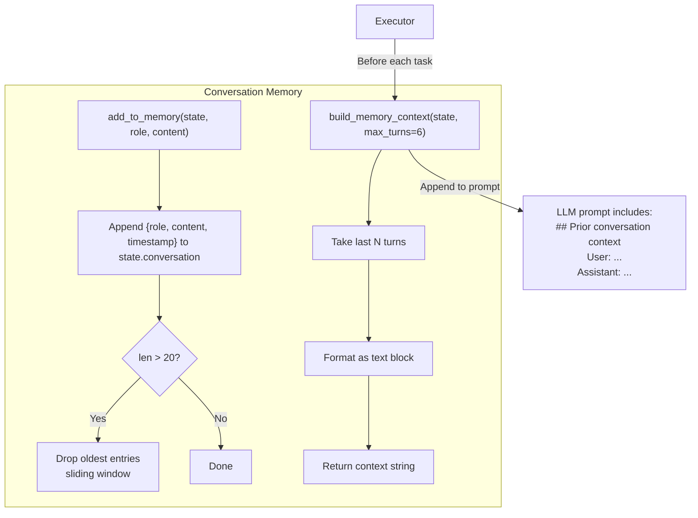

### Code:

```python
from __future__ import annotations

SLIDING_WINDOW_SIZE = 20


def add_to_memory(state: dict, role: str, content: str) -> None:
    """Append a turn to conversation memory, keeping a sliding window."""
    if "conversation" not in state:
        state["conversation"] = []
    state["conversation"].append({
        "role": role,
        "content": content,
        "timestamp": str(__import__("datetime").datetime.now()),
    })
    if len(state["conversation"]) > SLIDING_WINDOW_SIZE:
        state["conversation"] = state["conversation"][-SLIDING_WINDOW_SIZE:]


def build_memory_context(state: dict, max_turns: int = 6) -> str:
    """
    Build a context string from recent conversation history.
    Used when constructing prompts so the LLM knows what happened before.
    """
    turns = state.get("conversation", [])
    if not turns:
        return ""
    recent = turns[-max_turns:]
    lines = ["## Prior conversation context:"]
    for t in recent:
        label = "User" if t["role"] == "user" else "Assistant"
        truncated = t["content"][:300]
        lines.append(f"  {label}: {truncated}")
    return "\n".join(lines) + "\n"
```

### How it's used

1. When the user submits a request, `orchestrator.py` calls `add_to_memory("user", request_text)`
2. When each task completes, `executor.py` calls `add_to_memory("assistant", task_result)`
3. Before each task prompt, `executor.py` calls `build_memory_context()` which returns the last 6 exchanges as text
4. This text is injected into the system prompt so the LLM knows what sections have already been written

### Why Sliding Window?

Gemini-1.5-flash has a 32k token context window. If a conversation has 100+ exchanges, we'd exceed it. The sliding window keeps only the last 20 turns, and `build_memory_context` only uses the last 6. This ensures the LLM always has relevant context without hitting token limits.

---

## 6. Planner

**File:** `agent/planner.py`

### Purpose

Takes a raw natural language request and decomposes it into structured tasks with dependency information. This is the **multi-step planning** feature.

### Architecture

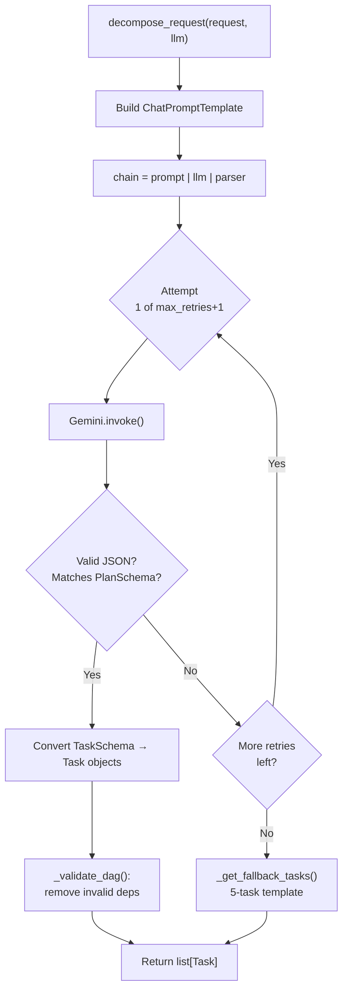

### Two Schemas — Why?

```mermaid
flowchart LR
    subgraph LLM_Output["What Gemini Returns"]
        direction TB
        G1["PlanSchema.tasks[0].id = 1"]
        G2["PlanSchema.tasks[0].title = 'Summary'"]
        G3["PlanSchema.tasks[0].depends_on = null"]
    end
    
    subgraph Internal_Model["What the Executor Uses"]
        direction TB
        I1["Task.id = 1"]
        I2["Task.title = 'Summary'"]
        I3["Task.status = PENDING"]
        I4["Task.result = ''"]
        I5["Task.retry_count = 0"]
    end
    
    LLM_Output -->|"Task(**t.model_dump())"| Internal_Model
    
    note right of LLM_Output
        4 fields — only what the LLM
        should produce
    end note
    
    note right of Internal_Model
        8 fields — runtime tracking
        fields the LLM must NOT control
    end note
```

### Code:

```python
from __future__ import annotations

import json
import logging
from typing import Optional

from langchain_core.output_parsers import PydanticOutputParser
from langchain_core.prompts import ChatPromptTemplate
from pydantic import BaseModel, Field

from agent.memory import add_to_memory
from agent.models import Task, TaskStatus

logger = logging.getLogger(__name__)


class TaskSchema(BaseModel):
    """Schema the LLM must return. 4 fields only."""
    id: int = Field(description="Unique task ID, starting from 1")
    title: str = Field(description="Task title, under 10 words")
    description: str = Field(description="What to produce, 1-2 sentences")
    depends_on: Optional[list[int]] = Field(
        None, description="IDs of prerequisite tasks. null for root tasks."
    )


class PlanSchema(BaseModel):
    """Wrapper: LLM returns a list of tasks."""
    tasks: list[TaskSchema]


FALLBACK_TASKS = [
    Task(id=1, title="Executive Summary",
         description="Write a concise executive summary covering the key points."),
    Task(id=2, title="Background & Context",
         description="Research and describe the background context."),
    Task(id=3, title="Main Content",
         description="Write the main body content.", depends_on=[1, 2]),
    Task(id=4, title="Supporting Data",
         description="Include relevant data and examples.", depends_on=[3]),
    Task(id=5, title="Conclusion & Next Steps",
         description="Summarize findings and list next steps.", depends_on=[4]),
]


def decompose_request(request: str, llm, max_retries: int = 2) -> list[Task]:
    """
    Decompose a natural language request into structured tasks.

    Uses Gemini via LangChain's PydanticOutputParser. Falls back to a
    hardcoded 5-task template if all LLM attempts fail.
    """
    parser = PydanticOutputParser(pydantic_object=PlanSchema)

    prompt = ChatPromptTemplate.from_messages([
        ("system",
         "You are an expert project planner. Break the user's request into "
         "3-8 concrete, sequential tasks. Each task must be independently "
         "executable.\n\n{format_instructions}\n\n"
         "Rules:\n"
         "- id must be a unique integer starting from 1\n"
         "- depends_on must reference existing task IDs, or be null for root tasks\n"
         "- Return ONLY valid JSON, no markdown fences, no explanation"),
        ("human", "{request}"),
    ])

    chain = prompt | llm | parser

    for attempt in range(max_retries + 1):
        try:
            plan = chain.invoke({
                "request": request,
                "format_instructions": parser.get_format_instructions(),
            })
            tasks = [Task(**t.model_dump()) for t in plan.tasks]
            _validate_dag(tasks)
            logger.info("Successfully decomposed request into %d tasks", len(tasks))
            return tasks
        except Exception as e:
            logger.warning("Planner attempt %d/%d failed: %s",
                           attempt + 1, max_retries + 1, e)
            if attempt < max_retries:
                continue

    logger.warning("All LLM planner attempts failed. Using fallback template.")
    return _get_fallback_tasks(request)


def _validate_dag(tasks: list[Task]) -> None:
    """Validate dependency graph: no dangling references."""
    task_ids = {t.id for t in tasks}
    for t in tasks:
        if t.depends_on:
            t.depends_on = [d for d in t.depends_on if d in task_ids]


def _get_fallback_tasks(request: str) -> list[Task]:
    """Return annotated fallback tasks when LLM fails."""
    return FALLBACK_TASKS
```

### Retry Logic

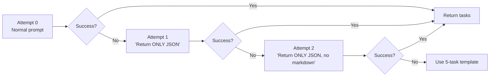

### Prompt Template (what Gemini sees)

```
System: You are an expert project planner. Break the user's request into
3-8 concrete, sequential tasks. Each task must be independently
executable.

You must return a JSON object with this exact structure:
{"tasks": [{"id": 1, "title": "...", "description": "...", "depends_on": null}, ...]}

Rules:
- id must be a unique integer starting from 1
- depends_on must reference existing task IDs, or be null for root tasks
- Return ONLY valid JSON, no markdown fences, no explanation

Human: Write a project proposal for a carbon-tracking mobile app...
```

### Example LLM Response

```json
{
  "tasks": [
    {"id": 1, "title": "Executive Summary", "description": "Write a 2-3 paragraph executive summary covering...", "depends_on": null},
    {"id": 2, "title": "Feature List", "description": "List the core features of the carbon-tracking app...", "depends_on": [1]},
    {"id": 3, "title": "Project Timeline", "description": "Create a timeline with milestones...", "depends_on": [1]},
    {"id": 4, "title": "Resource Requirements", "description": "List team, tools, and budget...", "depends_on": [2, 3]},
    {"id": 5, "title": "Risk Assessment", "description": "Identify top risks with mitigations...", "depends_on": [4]}
  ]
}
```

---

## 7. Executor

**File:** `agent/executor.py`

### Purpose

Executes tasks in dependency order (topological DAG). For each task, builds a context-aware prompt and calls Gemini with exponential backoff retry.

### Architecture

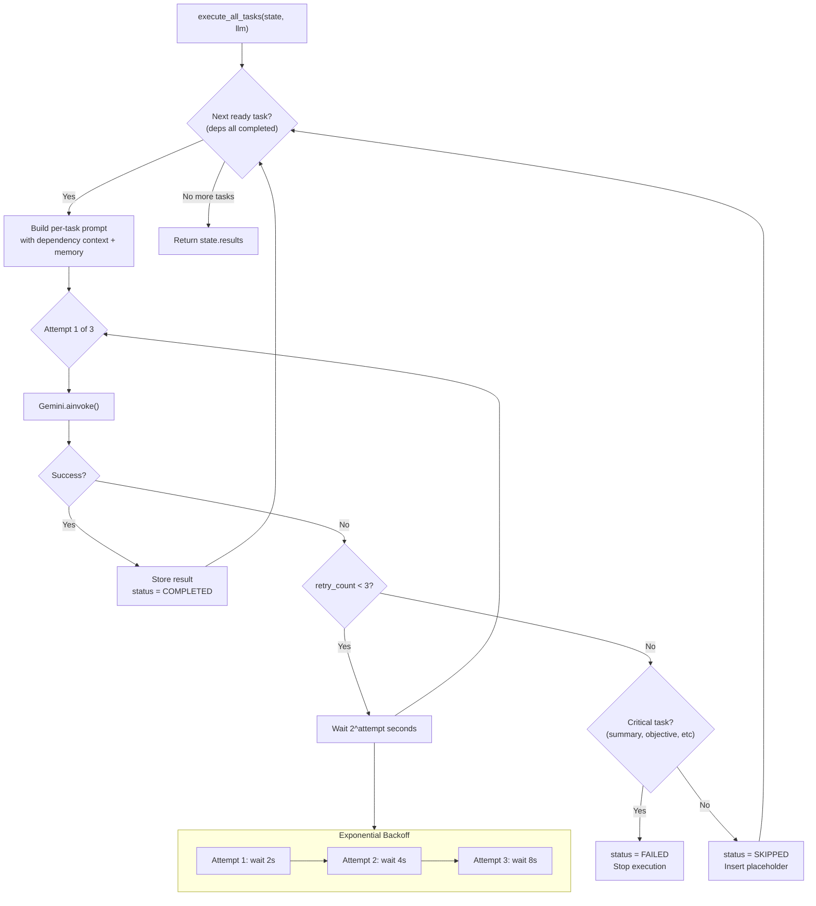

### Code:

```python
from __future__ import annotations

import asyncio
import logging
from typing import Optional

from langchain_core.prompts import ChatPromptTemplate

from agent.memory import add_to_memory, build_memory_context
from agent.models import AgentState, Task, TaskStatus

logger = logging.getLogger(__name__)


async def execute_all_tasks(
    state: AgentState,
    llm,
    max_retries: int = 3,
    base_delay: float = 2.0,
) -> dict[int, str]:
    """
    Execute all tasks in dependency order (topological DAG).

    For each ready task:
    1. Build prompt with context from completed dependencies
    2. Call LLM with exponential backoff retry
    3. On failure: skip non-critical, fail critical
    4. Store result in state

    Returns state.results dict.
    """
    prompt = ChatPromptTemplate.from_messages([
        ("system",
         "You are a professional business writer. Write well-structured "
         "content for the section described.\n\n"
         "{memory_context}"
         "Context from previous sections:\n{dependency_context}"),
        ("human",
         "Task: {task_title}\n{task_description}\n\n"
         "Use markdown formatting with headings, bullet points, and tables "
         "where appropriate. Be specific and detailed."),
    ])

    while True:
        task = _next_ready_task(state.tasks)
        if task is None:
            break

        logger.info("Executing task %d: %s", task.id, task.title)
        task.status = TaskStatus.RUNNING

        dep_context = _build_dependency_context(task, state)
        mem_context = build_memory_context(state.model_dump())

        success = False
        for attempt in range(max_retries):
            mem_context_attempt = (
                f"{mem_context}\n" if mem_context else ""
            )
            if attempt > 0:
                mem_context_attempt += (
                    f"Note: Previous attempt {attempt} failed. "
                    f"Error: {task.error}\n"
                    f"Please produce a different, correct response this time."
                )

            try:
                result = await llm.ainvoke(
                    prompt.invoke({
                        "memory_context": mem_context_attempt,
                        "dependency_context": dep_context,
                        "task_title": task.title,
                        "task_description": task.description,
                    })
                )
                task.result = result.content
                task.status = TaskStatus.COMPLETED
                state.results[task.id] = result.content
                add_to_memory(
                    state.model_dump(),
                    "assistant",
                    f"[Task {task.id}: {task.title}]\n{result.content[:500]}",
                )
                success = True
                logger.info("Task %d completed successfully", task.id)
                break
            except Exception as e:
                task.error = str(e)
                task.retry_count += 1
                logger.warning(
                    "Task %d attempt %d/%d failed: %s",
                    task.id, attempt + 1, max_retries, e,
                )
                if attempt < max_retries - 1:
                    delay = base_delay * (2 ** attempt)
                    await asyncio.sleep(delay)

        if not success:
            if _is_critical(task):
                task.status = TaskStatus.FAILED
                state.error = (
                    f"Critical task {task.id} ({task.title}) failed: {task.error}"
                )
                logger.error(state.error)
                break
            else:
                task.status = TaskStatus.SKIPPED
                task.result = f"[{task.title} could not be generated]"
                state.results[task.id] = task.result
                logger.warning("Task %d skipped after %d failures",
                               task.id, max_retries)

    return state.results


def _next_ready_task(tasks: list[Task]) -> Optional[Task]:
    """Find the first pending task whose dependencies are all completed."""
    completed_ids = {
        t.id for t in tasks
        if t.status == TaskStatus.COMPLETED
    }
    for task in tasks:
        if task.status != TaskStatus.PENDING:
            continue
        deps = task.depends_on or []
        if all(d in completed_ids for d in deps):
            return task
    return None


def _build_dependency_context(task: Task, state: AgentState) -> str:
    """Build context string from completed dependency tasks."""
    parts = []
    for dep_id in (task.depends_on or []):
        dep_result = state.results.get(dep_id, "")
        dep_title = ""
        for t in state.tasks:
            if t.id == dep_id:
                dep_title = t.title
                break
        if dep_result:
            parts.append(f"--- {dep_title} ---\n{dep_result[:2000]}")
    return "\n\n".join(parts)


def _is_critical(task: Task) -> bool:
    """Determine if a task is critical (fails the whole agent)."""
    keywords = ["summary", "objective", "scope", "conclusion", "executive"]
    title_lower = task.title.lower()
    return any(kw in title_lower for kw in keywords)
```

### Dependency Resolution Flow

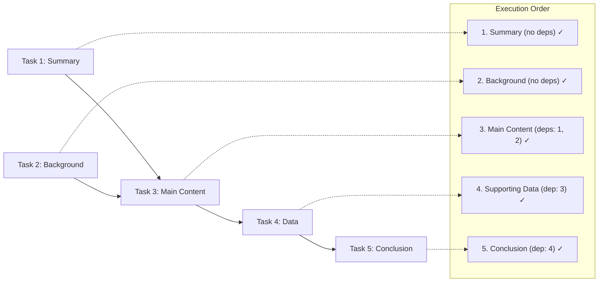

Tasks 1 and 2 can run in parallel (both have no dependencies). Task 3 waits for both. Tasks 4 and 5 wait for their predecessor.

---

## 8. Orchestrator

**File:** `agent/orchestrator.py`

### Purpose

The central coordinator that manages the agent lifecycle. Stores all `AgentState` instances in-memory and provides the `run()` method called by FastAPI's BackgroundTasks.

### Architecture

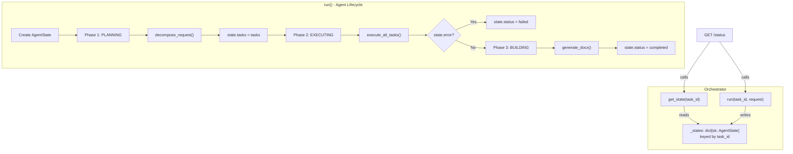

### Code:

```python
from __future__ import annotations

import asyncio
import logging
from datetime import datetime

from agent.executor import execute_all_tasks
from agent.memory import add_to_memory
from agent.models import AgentState
from agent.planner import decompose_request

logger = logging.getLogger(__name__)


class Orchestrator:
    """
    Manages the full agent lifecycle: plan -> execute -> build.

    Stores AgentState in-memory keyed by task_id.
    """

    def __init__(self, llm):
        self._llm = llm
        self._states: dict[str, AgentState] = {}

    async def run(self, task_id: str, request: str) -> None:
        """Full agent pipeline. Runs as a background task."""
        logger.info("Starting agent run %s: %s", task_id, request[:80])

        state = AgentState(task_id=task_id, request=request)
        self._states[task_id] = state

        try:
            # Phase 1: Plan
            state.status = "planning"
            add_to_memory(state.model_dump(), "user", request)

            tasks = decompose_request(request, self._llm)
            state.tasks = tasks
            state.status = "executing"
            state.updated_at = datetime.now()

            # Phase 2: Execute
            results = await execute_all_tasks(state, self._llm)
            state.results = results

            if state.error:
                state.status = "failed"
                logger.error("Agent run %s failed: %s", task_id, state.error)
                return

            # Phase 3: Build document
            state.status = "building"
            state.updated_at = datetime.now()
            docx_path = await self._build_document(state)
            state.docx_path = docx_path
            state.status = "completed"

        except Exception as e:
            state.status = "failed"
            state.error = str(e)
            logger.exception("Agent run %s failed unexpectedly", task_id)
        finally:
            state.updated_at = datetime.now()

    def get_state(self, task_id: str) -> AgentState | None:
        return self._states.get(task_id)

    async def _build_document(self, state: AgentState) -> str:
        """
        Generate the final .docx document from all task results.
        Uses python-docx to produce a polished document.
        """
        import os
        from docbuilder.builder import generate_docx

        os.makedirs("outputs", exist_ok=True)
        path = f"outputs/{state.task_id}.docx"
        generate_docx(state, path)
        return path
```

### State Transitions

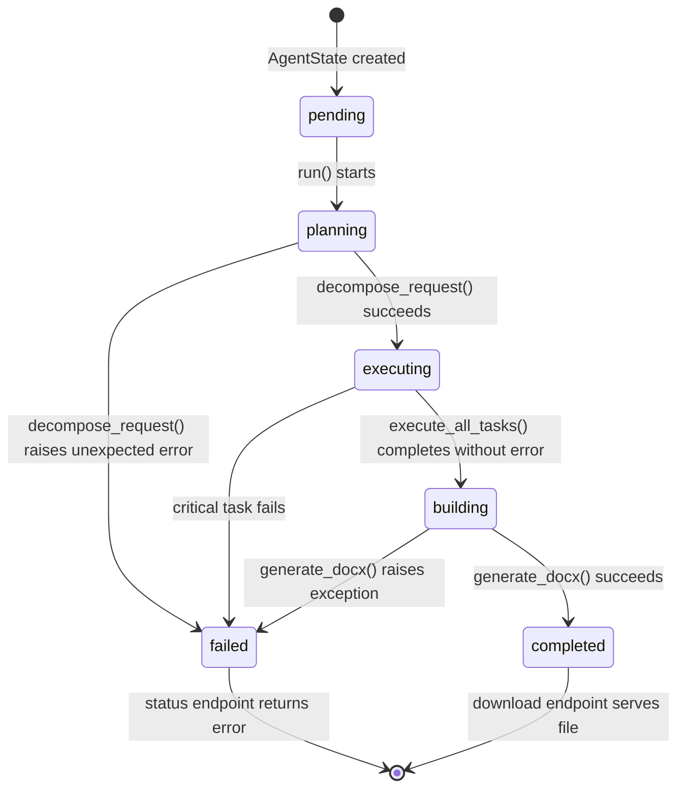

---

## 9. LLM Client Layer

**File:** `llm/client.py` and `llm/mock_client.py`

### Architecture

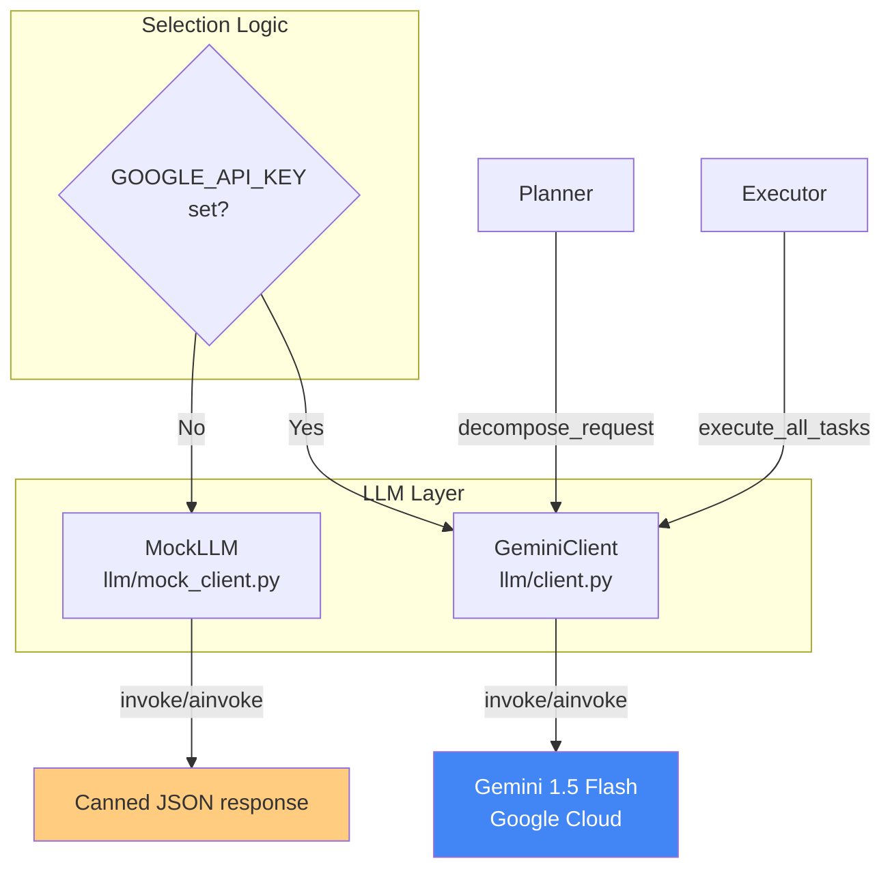

### GeminiClient Code

```python
from __future__ import annotations

import logging
import os

from langchain_google_genai import ChatGoogleGenerativeAI

logger = logging.getLogger(__name__)


class GeminiClient:
    """
    Wrapper around ChatGoogleGenerativeAI with error handling.
    Uses GOOGLE_API_KEY from environment.
    """

    def __init__(self, model: str = "gemini-1.5-flash", temperature: float = 0.7):
        self.model = model
        self.temperature = temperature
        self._llm: ChatGoogleGenerativeAI | None = None

    @property
    def llm(self) -> ChatGoogleGenerativeAI:
        if self._llm is None:
            api_key = os.environ.get("GOOGLE_API_KEY")
            if not api_key:
                from llm.mock_client import MockLLM
                logger.warning("No GOOGLE_API_KEY set. Using MockLLM.")
                return MockLLM()

            self._llm = ChatGoogleGenerativeAI(
                model=self.model,
                temperature=self.temperature,
                google_api_key=api_key,
            )
        return self._llm

    def invoke(self, messages):
        return self.llm.invoke(messages)

    async def ainvoke(self, messages):
        return await self.llm.ainvoke(messages)


def get_llm() -> GeminiClient:
    """Factory: returns a configured GeminiClient."""
    return GeminiClient()
```

### MockLLM Code

```python
from __future__ import annotations

import json
from typing import Any
from langchain_core.messages import AIMessage


class MockLLM:
    """
    Returns canned responses when no API key is available.
    Used for testing without Gemini costs.
    """

    def invoke(self, messages: Any) -> AIMessage:
        return self._respond()

    async def ainvoke(self, messages: Any) -> AIMessage:
        return self._respond()

    def _respond(self) -> AIMessage:
        content = json.dumps({
            "tasks": [
                {"id": 1, "title": "Executive Summary",
                 "description": "Write a brief executive summary.",
                 "depends_on": None},
                {"id": 2, "title": "Background Research",
                 "description": "Gather context and background information.",
                 "depends_on": [1]},
                {"id": 3, "title": "Main Content",
                 "description": "Write the detailed body content.",
                 "depends_on": [1, 2]},
            ]
        })
        return AIMessage(content=content)
```

### How to Configure

```bash
# In terminal (Linux/Mac)
export GOOGLE_API_KEY="your-key-here"

# In terminal (Windows PowerShell)
$env:GOOGLE_API_KEY = "your-key-here"

# Or in .env file
echo "GOOGLE_API_KEY=your-key-here" > .env
```

Get your free API key at: https://aistudio.google.com/app/apikey

---

## 10. Document Builder

**File:** `docbuilder/builder.py`

### Purpose

Converts the agent's task results (markdown text) into a polished `.docx` file with proper styling, tables, headings, and a cover page.

### Architecture

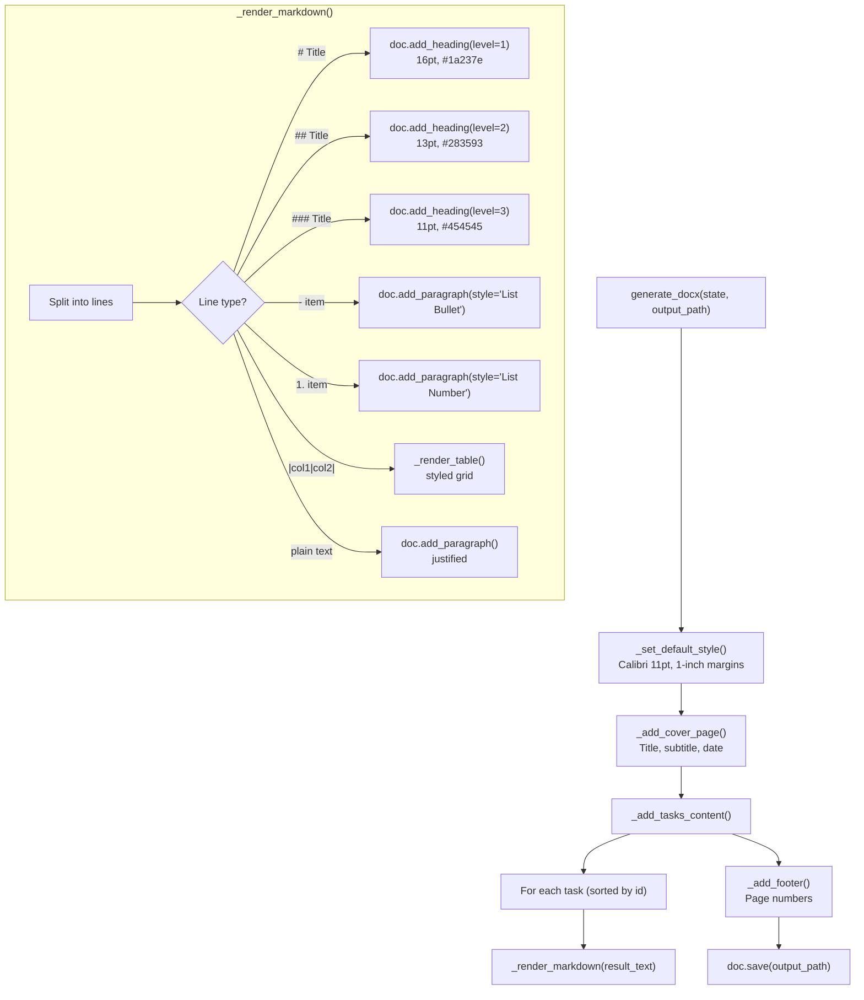

### Code:

```python
from __future__ import annotations

import re
from datetime import datetime

from docx import Document
from docx.enum.text import WD_ALIGN_PARAGRAPH
from docx.enum.table import WD_TABLE_ALIGNMENT
from docx.shared import Inches, Pt, RGBColor
from docx.oxml.ns import qn

from agent.models import AgentState


def generate_docx(state: AgentState, output_path: str) -> None:
    """
    Generate a polished .docx document from agent task results.
    Parses task results as markdown and renders into a styled Word document.
    """
    doc = Document()

    _set_default_style(doc)
    _add_cover_page(doc, state.request)
    _add_tasks_content(doc, state)
    _add_footer(doc)

    doc.save(output_path)


def _set_default_style(doc: Document) -> None:
    """Configure default font and paragraph spacing."""
    style = doc.styles["Normal"]
    font = style.font
    font.name = "Calibri"
    font.size = Pt(11)
    font.color.rgb = RGBColor(0x33, 0x33, 0x33)

    for section in doc.sections:
        section.top_margin = Inches(1)
        section.bottom_margin = Inches(1)
        section.left_margin = Inches(1)
        section.right_margin = Inches(1)


def _add_cover_page(doc: Document, request: str) -> None:
    """Add a centered cover page with title and metadata."""
    for _ in range(6):
        doc.add_paragraph()

    title_text = _extract_title(request)
    title = doc.add_paragraph()
    title.alignment = WD_ALIGN_PARAGRAPH.CENTER
    run = title.add_run(title_text)
    run.bold = True
    run.font.size = Pt(26)
    run.font.color.rgb = RGBColor(0x1A, 0x23, 0x7E)
    run.font.name = "Calibri"

    subtitle = doc.add_paragraph()
    subtitle.alignment = WD_ALIGN_PARAGRAPH.CENTER
    run = subtitle.add_run("Prepared by Autonomous AI Agent")
    run.font.size = Pt(14)
    run.font.color.rgb = RGBColor(0x66, 0x66, 0x66)

    date_p = doc.add_paragraph()
    date_p.alignment = WD_ALIGN_PARAGRAPH.CENTER
    run = date_p.add_run(datetime.now().strftime("%B %d, %Y"))
    run.font.size = Pt(12)
    run.font.color.rgb = RGBColor(0x99, 0x99, 0x99)

    doc.add_page_break()


def _add_tasks_content(doc: Document, state: AgentState) -> None:
    """Render each task's result as a section in the document."""
    tasks = sorted(state.tasks, key=lambda t: t.id)

    for task in tasks:
        if task.status.value in ("failed",):
            continue

        result_text = state.results.get(task.id, task.result)
        if not result_text:
            result_text = task.result if task.result else "[Content not available]"

        _render_markdown(doc, f"# {task.title}\n\n{result_text}")


def _render_markdown(doc: Document, markdown_text: str) -> None:
    """Parse simplified markdown and add matching docx elements."""
    lines = markdown_text.split("\n")
    in_table = False
    table_buffer = []

    i = 0
    while i < len(lines):
        line = lines[i]

        # Table detection
        if line.strip().startswith("|") and line.strip().endswith("|"):
            table_buffer.append(line.strip())
            in_table = True
            i += 1
            continue
        if in_table:
            _render_table(doc, table_buffer)
            table_buffer = []
            in_table = False
            continue

        stripped = line.strip()

        if not stripped:
            i += 1
            continue

        # Heading 1
        if stripped.startswith("# ") and not stripped.startswith("## "):
            text = stripped[2:]
            h = doc.add_heading(text, level=1)
            _style_heading(h, 0)
            i += 1
            continue

        # Heading 2
        if stripped.startswith("## ") and not stripped.startswith("### "):
            text = stripped[3:]
            h = doc.add_heading(text, level=2)
            _style_heading(h, 1)
            i += 1
            continue

        # Heading 3
        if stripped.startswith("### "):
            text = stripped[4:]
            h = doc.add_heading(text, level=3)
            _style_heading(h, 2)
            i += 1
            continue

        # Bullet list
        if stripped.startswith("- ") or stripped.startswith("* "):
            text = stripped[2:]
            p = doc.add_paragraph(text, style="List Bullet")
            _apply_bold_inline(p)
            i += 1
            continue

        # Numbered list
        match = re.match(r"^(\d+)\.\s+(.*)", stripped)
        if match:
            text = match.group(2)
            p = doc.add_paragraph(text, style="List Number")
            _apply_bold_inline(p)
            i += 1
            continue

        # Paragraph
        p = doc.add_paragraph()
        p.alignment = WD_ALIGN_PARAGRAPH.LEFT
        p.paragraph_format.space_after = Pt(6)
        _add_run_with_bold(p, stripped)
        i += 1

    if in_table and table_buffer:
        _render_table(doc, table_buffer)


def _render_table(doc: Document, table_lines: list[str]) -> None:
    """Render markdown table as a styled docx table."""
    if len(table_lines) < 2:
        return

    header_cells = [c.strip() for c in table_lines[0].strip("|").split("|")]
    rows = []
    for line in table_lines[2:]:
        cells = [c.strip() for c in line.strip("|").split("|")]
        if cells:
            rows.append(cells)

    if not rows:
        return

    ncols = len(header_cells)
    table = doc.add_table(rows=1 + len(rows), cols=ncols)
    table.alignment = WD_TABLE_ALIGNMENT.CENTER
    table.style = "Table Grid"

    # Header row
    for j, cell_text in enumerate(header_cells):
        cell = table.rows[0].cells[j]
        cell.text = cell_text
        _shade_cell(cell, RGBColor(0x1A, 0x23, 0x7E))
        for paragraph in cell.paragraphs:
            paragraph.alignment = WD_ALIGN_PARAGRAPH.CENTER
            for run in paragraph.runs:
                run.bold = True
                run.font.color.rgb = RGBColor(0xFF, 0xFF, 0xFF)
                run.font.size = Pt(10)

    # Data rows
    for i, row in enumerate(rows):
        for j, cell_text in enumerate(row):
            if j < ncols:
                cell = table.rows[i + 1].cells[j]
                cell.text = cell_text
                for paragraph in cell.paragraphs:
                    for run in paragraph.runs:
                        run.font.size = Pt(10)
                if i % 2 == 1:
                    _shade_cell(cell, RGBColor(0xF5, 0xF5, 0xF5))

    doc.add_paragraph()
```

### Supported Markdown → docx Mappings

| Markdown | docx Output | Style |
|---|---|---|
| `# Title` | Heading level 1 | 16pt, #1a237e (dark blue) |
| `## Section` | Heading level 2 | 13pt, #283593 |
| `### Subsection` | Heading level 3 | 11pt, #454545 |
| `- item` | Bullet list | List Bullet style |
| `1. item` | Numbered list | List Number style |
| `\| col1 \| col2 \|` | Table with header | Grid with dark header + alternating rows |
| `**bold**` | Bold run | Bold = True |
| Plain text | Paragraph | Calibri 11pt, justified |

---

## 11. FastAPI Routes

**File:** `main.py`

### Architecture

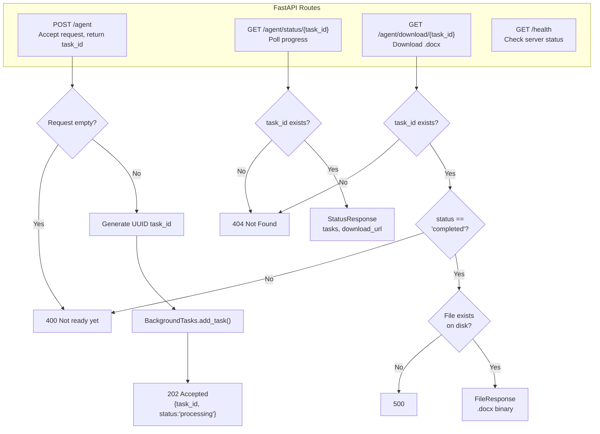

### Code:

```python
from __future__ import annotations

import logging
import os
import uuid

from fastapi import BackgroundTasks, FastAPI, HTTPException
from fastapi.responses import FileResponse
from pydantic import BaseModel

from agent.orchestrator import Orchestrator
from llm import get_llm

logging.basicConfig(
    level=logging.INFO,
    format="%(asctime)s %(levelname)s %(name)s: %(message)s",
)
logger = logging.getLogger(__name__)

app = FastAPI(
    title="Autonomous AI Agent",
    description="Accepts a natural language request, plans tasks, executes them, and returns a .docx document.",
    version="1.0.0",
)

llm_client = get_llm()
orchestrator = Orchestrator(llm=llm_client.llm)


class RequestInput(BaseModel):
    request: str


class StatusResponse(BaseModel):
    task_id: str
    status: str
    tasks: list[dict] = []
    download_url: str = ""
    error: str = ""


@app.post("/agent", status_code=202)
async def submit_request(body: RequestInput, background_tasks: BackgroundTasks):
    """
    Submit a natural language request.

    Returns immediately with a task_id. The agent runs in the background.
    Poll GET /agent/status/{task_id} for completion.
    """
    if not body.request.strip():
        raise HTTPException(status_code=400, detail="Request cannot be empty.")

    task_id = str(uuid.uuid4())
    background_tasks.add_task(orchestrator.run, task_id, body.request)

    logger.info("Accepted request %s: %s", task_id, body.request[:80])

    return {
        "task_id": task_id,
        "status": "processing",
        "message": "Agent is working on your request.",
    }


@app.get("/agent/status/{task_id}", response_model=StatusResponse)
async def get_status(task_id: str):
    """Poll the status of an agent run."""
    state = orchestrator.get_state(task_id)
    if state is None:
        raise HTTPException(status_code=404, detail=f"Task {task_id} not found.")

    tasks_list = [
        {
            "id": t.id,
            "title": t.title,
            "status": t.status.value,
            "retry_count": t.retry_count,
        }
        for t in state.tasks
    ]

    return StatusResponse(
        task_id=task_id,
        status=state.status,
        tasks=tasks_list,
        download_url=(
            f"/agent/download/{task_id}" if state.status == "completed" else ""
        ),
        error=state.error,
    )


@app.get("/agent/download/{task_id}")
async def download_docx(task_id: str):
    """Download the generated .docx document."""
    state = orchestrator.get_state(task_id)
    if state is None:
        raise HTTPException(status_code=404, detail=f"Task {task_id} not found.")
    if state.status != "completed":
        raise HTTPException(status_code=400, detail="Document is not ready yet.")
    if not os.path.exists(state.docx_path):
        raise HTTPException(
            status_code=500, detail="Document file not found on disk."
        )

    filename = f"{state.request[:50].replace(' ', '_')}.docx"
    return FileResponse(
        path=state.docx_path,
        media_type="application/vnd.openxmlformats-officedocument.wordprocessingml.document",
        filename=filename,
    )


@app.get("/health")
async def health():
    return {"status": "ok"}
```

### API Contract Summary

| Endpoint | Method | Status | Body |
|---|---|---|---|
| `/agent` | POST | 202 | `{"task_id": "uuid", "status": "processing"}` |
| `/agent/status/{id}` | GET | 200 | `{"task_id", "status", "tasks": [...], "download_url"}` |
| `/agent/download/{id}` | GET | 200 | Binary .docx stream |
| `/health` | GET | 200 | `{"status": "ok"}` |

---

## 12. Running the System

### Prerequisites

- Python 3.10+
- Gemini API key (free, no credit card required)
- Get key at: https://aistudio.google.com/app/apikey

### Setup

```bash
# 1. Create virtual environment
python -m venv venv

# Activate (Windows)
venv\Scripts\activate

# Activate (Mac/Linux)
source venv/bin/activate

# 2. Install dependencies
pip install -r requirements.txt

# 3. Set your API key (Windows PowerShell)
$env:GOOGLE_API_KEY = "your-key-here"

# Or create .env file
echo GOOGLE_API_KEY=your-key-here > .env
```

### Run

```bash
# Start the server
uvicorn main:app --reload --port 8000

# In another terminal, test with a standard request
curl -X POST http://localhost:8000/agent \
  -H "Content-Type: application/json" \
  -d '{"request": "Write a project proposal for a carbon-tracking mobile app. Include executive summary, features, timeline, resources, and risk assessment."}'

# Response: {"task_id": "abc-123", "status": "processing"}

# Poll for status
curl http://localhost:8000/agent/status/abc-123

# When status is "completed", download the document
curl -o proposal.docx http://localhost:8000/agent/download/abc-123
```

### With MockLLM (No API Key)

If you don't set `GOOGLE_API_KEY`, the system automatically falls back to `MockLLM`. The planner returns 3 canned tasks, and the executor returns mock content. The document generation still works end-to-end.

```bash
# No API key needed — runs entirely offline
uvicorn main:app --reload --port 8000
```

---

## 13. Complete State Visualization (Walkthrough)

This section shows the **exact state** of the system at every step of a real run with the request:

```json
{"request": "Write a project proposal for a carbon-tracking mobile app. Include executive summary, features, timeline, resources, and risk assessment."}
```

### Step 0: Initial State (Right After POST /agent)

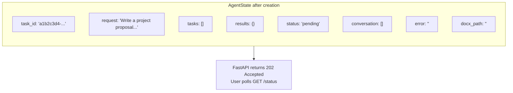

**State dump:**
```json
{
  "task_id": "a1b2c3d4-e5f6-7890-abcd-ef1234567890",
  "request": "Write a project proposal for a carbon-tracking mobile app. Include executive summary, features, timeline, resources, and risk assessment.",
  "tasks": [],
  "results": {},
  "status": "pending",
  "error": "",
  "conversation": [],
  "docx_path": "",
  "created_at": "2026-07-10T12:00:00Z",
  "updated_at": "2026-07-10T12:00:00Z"
}
```

---

### Step 1: After Planning (Phase 1 Complete)

Orchestrator called `decompose_request()`. Gemini returned the task list. The LLM was sent this prompt:

```
System: You are an expert project planner. Break the user's request into
3-8 concrete, sequential tasks...

You must return a JSON object with this exact structure:
{"tasks": [{"id": 1, "title": "...", "description": "...", "depends_on": null}, ...]}

Human: Write a project proposal for a carbon-tracking mobile app...
```

**What Gemini returned:**
```json
{
  "tasks": [
    {"id": 1, "title": "Executive Summary", "description": "Write a 2-3 paragraph executive summary covering the app's purpose, target audience, and expected impact.", "depends_on": null},
    {"id": 2, "title": "Feature List", "description": "List 6-8 core features with brief descriptions of each.", "depends_on": [1]},
    {"id": 3, "title": "Project Timeline", "description": "Create a phased timeline with milestones, durations, and deliverables in a table.", "depends_on": [1]},
    {"id": 4, "title": "Resource Requirements", "description": "List team members, tools, and budget estimates.", "depends_on": [2, 3]},
    {"id": 5, "title": "Risk Assessment", "description": "Identify top 5 risks with probability, impact, and mitigation strategies in a table.", "depends_on": [4]}
  ]
}
```

**State after planning:**
```json
{
  "task_id": "a1b2c3d4-...",
  "request": "Write a project proposal...",
  "tasks": [
    {
      "id": 1,
      "title": "Executive Summary",
      "description": "Write a 2-3 paragraph executive summary...",
      "depends_on": null,
      "status": "pending",
      "result": "",
      "retry_count": 0,
      "error": ""
    },
    {
      "id": 2,
      "title": "Feature List",
      "description": "List 6-8 core features...",
      "depends_on": [1],
      "status": "pending",
      "result": "",
      "retry_count": 0,
      "error": ""
    },
    {
      "id": 3,
      "title": "Project Timeline",
      "description": "Create a phased timeline...",
      "depends_on": [1],
      "status": "pending",
      "result": "",
      "retry_count": 0,
      "error": ""
    },
    {
      "id": 4,
      "title": "Resource Requirements",
      "description": "List team members, tools, and budget...",
      "depends_on": [2, 3],
      "status": "pending",
      "result": "",
      "retry_count": 0,
      "error": ""
    },
    {
      "id": 5,
      "title": "Risk Assessment",
      "description": "Identify top 5 risks...",
      "depends_on": [4],
      "status": "pending",
      "result": "",
      "retry_count": 0,
      "error": ""
    }
  ],
  "results": {},
  "status": "executing",
  "conversation": [
    {
      "role": "user",
      "content": "Write a project proposal for a carbon-tracking mobile app...",
      "timestamp": "2026-07-10T12:00:01Z"
    }
  ],
  "docx_path": ""
}
```

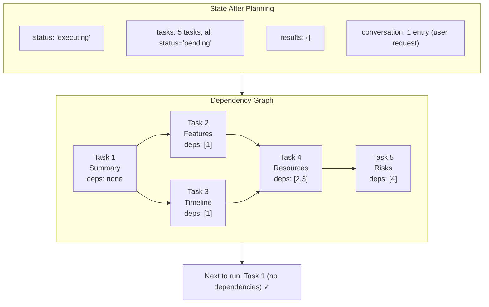

---

### Step 2: After Task 1 (Executive Summary) Completes

Executor found Task 1 is ready (no dependencies). Sent this prompt to Gemini:

```
System: You are a professional business writer. Write well-structured content
for the section described.

Context from previous sections:
(empty — no dependencies for this task)

Task: Executive Summary
Write a 2-3 paragraph executive summary covering the app's purpose, target
audience, and expected impact.
```

**Gemini returned:**
```
## Executive Summary

CarbonTrack is a mobile application designed to help individuals measure,
track, and reduce their personal carbon footprint...

The app targets environmentally conscious consumers aged 18-45 who want
actionable insights into their daily environmental impact...

We project 500,000 downloads in the first year with a 4.5-star rating
and an average carbon reduction of 15% per active user.
```

**State after Task 1:**
```json
{
  "tasks": [
    {
      "id": 1,
      "title": "Executive Summary",
      "status": "completed",
      "result": "## Executive Summary\n\nCarbonTrack is a mobile application...",
      "retry_count": 0,
      "error": ""
    },
    {
      "id": 2,
      "title": "Feature List",
      "status": "pending",
      ...
    },
    {
      "id": 3,
      "title": "Project Timeline",
      "status": "pending",
      ...
    },
    {
      "id": 4,
      "title": "Resource Requirements",
      "status": "pending",
      ...
    },
    {
      "id": 5,
      "title": "Risk Assessment",
      "status": "pending",
      ...
    }
  ],
  "results": {
    "1": "## Executive Summary\n\nCarbonTrack is a mobile application..."
  },
  "status": "executing",
  "conversation": [
    {"role": "user", "content": "Write a project proposal...", "timestamp": "..."},
    {"role": "assistant", "content": "[Task 1: Executive Summary]\n## Executive Summary...", "timestamp": "..."}
  ]
}
```

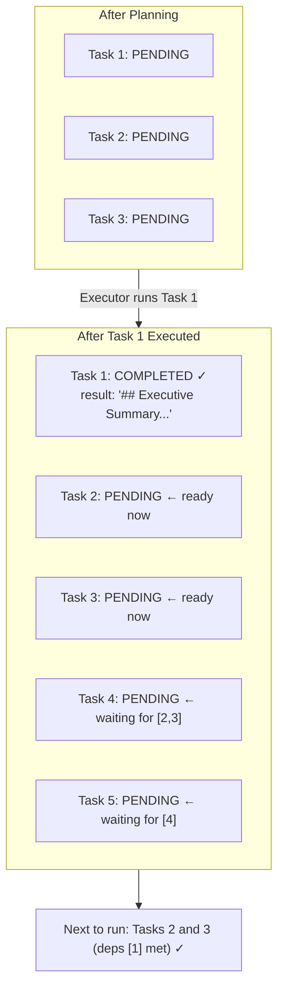

---

### Step 3: After Tasks 2 and 3 Complete

Tasks 2 and 3 have no dependencies on each other — they both depend only on Task 1 (which is done). The executor runs them sequentially.

**Prompt for Task 2 (Feature List):**
```
System: You are a professional business writer...

Context from previous sections:
--- Executive Summary ---
CarbonTrack is a mobile application designed to help...

Task: Feature List
List 6-8 core features with brief descriptions of each.
```

**Prompt for Task 3 (Project Timeline):**
```
System: You are a professional business writer...

Context from previous sections:
--- Executive Summary ---
CarbonTrack is a mobile application designed to help...

Task: Project Timeline
Create a phased timeline with milestones, durations, and deliverables.
```

**State after Tasks 2 and 3:**

```json
{
  "tasks": [
    {"id": 1, "title": "Executive Summary",  "status": "completed"},
    {"id": 2, "title": "Feature List",       "status": "completed",
     "result": "## Core Features\n\n1. **Carbon Calculator**...\n2. **Receipt Scanner**...\n3. **Monthly Reports**..."},
    {"id": 3, "title": "Project Timeline",    "status": "completed",
     "result": "## Timeline\n\n| Phase | Duration | Deliverable |\n| ..."},
    {"id": 4, "title": "Resource Requirements", "status": "pending"},
    {"id": 5, "title": "Risk Assessment",       "status": "pending"}
  ],
  "results": {
    "1": "## Executive Summary\n\nCarbonTrack is a mobile application...",
    "2": "## Core Features\n\n1. **Carbon Calculator**...",
    "3": "## Timeline\n\n| Phase | Duration | Deliverable |\n| ..."
  },
  "status": "executing",
  "conversation": [
    {"role": "user", "content": "Write a project proposal...", "timestamp": "..."},
    {"role": "assistant", "content": "[Task 1: Executive Summary]\n## Executive Summary...", "timestamp": "..."},
    {"role": "assistant", "content": "[Task 2: Feature List]\n## Core Features...", "timestamp": "..."},
    {"role": "assistant", "content": "[Task 3: Timeline]\n## Timeline...", "timestamp": "..."}
  ]
}
```

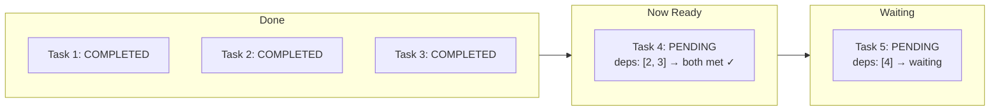

---

### Step 4: After Task 4 (Resources) — Context Injection in Action

Task 4 depends on both Task 2 and Task 3. The executor builds the prompt with BOTH results injected as context:

```
System: You are a professional business writer...

Context from previous sections:
--- Feature List ---
## Core Features
1. Carbon Calculator...
2. Receipt Scanner...
3. Monthly Reports...

--- Project Timeline ---
## Timeline
| Phase | Duration | Deliverable |
| Discovery | 2 weeks | PRD |

Task: Resource Requirements
List team members, tools, and budget estimates.
```

**Gemini returns:**
```
## Resource Requirements

| Role | Headcount | Commitment |
|------|-----------|------------|
| Project Manager | 1 | Full-time |
| iOS Developer | 2 | Full-time |
...

### Budget Estimate: $180,000

| Category | Cost |
|----------|------|
| Development | $120,000 |
| Design | $30,000 |
| Testing | $20,000 |
| Marketing | $10,000 |
```

**State after Task 4:**
```json
{
  "tasks": [
    {"id": 1, "status": "completed"},
    {"id": 2, "status": "completed"},
    {"id": 3, "status": "completed"},
    {"id": 4, "title": "Resource Requirements", "status": "completed",
     "result": "## Resource Requirements\n\n| Role | Headcount | Commitment |\n| ..."},
    {"id": 5, "status": "pending"}
  ],
  "results": {
    "1": "## Executive Summary...",
    "2": "## Core Features...",
    "3": "## Timeline...",
    "4": "## Resource Requirements\n\n| Role | Headcount..."
  },
  "status": "executing"
}
```

Now only Task 5 remains, and its dependency [4] is met.

---

### Step 5: After All Tasks Complete

**Final state when `status: "completed"`:**
```json
{
  "task_id": "a1b2c3d4-...",
  "request": "Write a project proposal for a carbon-tracking mobile app...",
  "tasks": [
    {"id": 1, "title": "Executive Summary",     "status": "completed",
     "result": "## Executive Summary\n\nCarbonTrack is a mobile application..."},
    {"id": 2, "title": "Feature List",          "status": "completed",
     "result": "## Core Features\n\n1. Carbon Calculator..."},
    {"id": 3, "title": "Project Timeline",      "status": "completed",
     "result": "## Project Timeline\n\n| Phase | Duration |..."},
    {"id": 4, "title": "Resource Requirements", "status": "completed",
     "result": "## Resource Requirements\n\n| Role | Headcount |..."},
    {"id": 5, "title": "Risk Assessment",       "status": "completed",
     "result": "## Risk Assessment\n\n| Risk | Probability | Impact |..."}
  ],
  "results": {
    "1": "## Executive Summary\n\nCarbonTrack is a mobile application...",
    "2": "## Core Features\n\n1. Carbon Calculator...",
    "3": "## Project Timeline\n\n| Phase | Duration |...",
    "4": "## Resource Requirements\n\n| Role | Headcount |...",
    "5": "## Risk Assessment\n\n| Risk | Probability | Impact |..."
  },
  "status": "completed",
  "error": "",
  "conversation": [
    {"role": "user", "content": "Write a project proposal...", "timestamp": "12:00:01"},
    {"role": "assistant", "content": "[Task 1: Executive Summary]\n## Executive Summary...", "timestamp": "12:00:08"},
    {"role": "assistant", "content": "[Task 2: Feature List]\n## Core Features...", "timestamp": "12:00:15"},
    {"role": "assistant", "content": "[Task 3: Project Timeline]\n## Timeline...", "timestamp": "12:00:22"},
    {"role": "assistant", "content": "[Task 4: Resource Requirements]\n## Resource...", "timestamp": "12:00:29"},
    {"role": "assistant", "content": "[Task 5: Risk Assessment]\n## Risk...", "timestamp": "12:00:36"}
  ],
  "docx_path": "outputs/a1b2c3d4-e5f6-7890-abcd-ef1234567890.docx",
  "created_at": "2026-07-10T12:00:00Z",
  "updated_at": "2026-07-10T12:00:40Z"
}
```

```mermaid
flowchart TB
    subgraph Final_State ["Final State"]
        direction TB
        FS1["status: 'completed'"]
        FS2["tasks: 5/5 completed"]
        FS3["results: 5 entries"]
        FS4["conversation: 6 entries (1 user + 5 assistant)"]
        FS5["docx_path: 'outputs/abc-123.docx'"]
        FS6["error: ''"]
    end
    
    subgraph Document_Structure ["Generated Document"]
        direction TB
        D1["Cover Page"]
        D2["Executive Summary"]
        D3["Core Features"]
        D4["Project Timeline"]
        D5["Resource Requirements"]
        D6["Risk Assessment"]
    end
    
    Final_State -->|"GET /download"| Document_Structure
    Document_Structure --> Download["User receives .docx file"]
```

---

### Error Scenario Demo

What happens when a task fails? Let's say Task 4 (Resources) fails all 3 retries because Gemini timed out:

```mermaid
flowchart TB
    T4_start["Task 4: Resource Requirements"] --> Attempt1["Attempt 1<br>Gemini timeout → error"]
    Attempt1 --> Wait1["Wait 2s"]
    Wait1 --> Attempt2["Attempt 2<br>Gemini timeout → error"]
    Attempt2 --> Wait2["Wait 4s"]
    Wait2 --> Attempt3["Attempt 3<br>Gemini timeout → error"]
    Attempt3 --> Decision{"Is Task 4 critical?"}
    
    Decision -->|"No (no keywords: summary, objective...)"| Skip["status: SKIPPED<br>result: '[Resource Requirements could not be generated]'"]
    Decision -->|"Yes (if title was 'Executive Summary')"| Fail["status: FAILED<br>state.error = 'Critical task failed'"]
    
    Skip --> Continue["Continue with Task 5 (if dep met) or finish"]
    Fail --> Stop["Stop execution, status = failed"]
```

**State after a non-critical task is skipped:**
```json
{
  "tasks": [
    {"id": 1, "status": "completed"},
    {"id": 2, "status": "completed"},
    {"id": 3, "status": "completed"},
    {"id": 4, "title": "Resource Requirements", "status": "skipped",
     "result": "[Resource Requirements could not be generated]",
     "retry_count": 3,
     "error": "google.api_core.exceptions.DeadlineExceeded: 408 Deadline Exceeded"},
    {"id": 5, "title": "Risk Assessment", "status": "completed",
     "result": "## Risk Assessment..."}
  ],
  "results": {
    "1": "## Executive Summary...",
    "2": "## Core Features...",
    "3": "## Project Timeline...",
    "5": "## Risk Assessment..."
  },
  "status": "completed",
  "error": ""
}
```

The document is still generated — it just has "[Resource Requirements could not be generated]" in place of section 4.

---

### Full API Response Maps

Each API endpoint returns different slices of the state:

**POST /agent response:**
```json
{
  "task_id": "a1b2c3d4-e5f6-7890-abcd-ef1234567890",
  "status": "processing",
  "message": "Agent is working on your request."
}
```

**GET /agent/status/{id} (while running):**
```json
{
  "task_id": "a1b2c3d4-...",
  "status": "executing",
  "tasks": [
    {"id": 1, "title": "Executive Summary",     "status": "completed", "retry_count": 0},
    {"id": 2, "title": "Feature List",          "status": "completed", "retry_count": 0},
    {"id": 3, "title": "Project Timeline",      "status": "running",   "retry_count": 1},
    {"id": 4, "title": "Resource Requirements", "status": "pending",   "retry_count": 0},
    {"id": 5, "title": "Risk Assessment",       "status": "pending",   "retry_count": 0}
  ],
  "download_url": "",
  "error": ""
}
```

**GET /agent/status/{id} (completed):**
```json
{
  "task_id": "a1b2c3d4-...",
  "status": "completed",
  "tasks": [
    {"id": 1, "status": "completed", "retry_count": 0},
    {"id": 2, "status": "completed", "retry_count": 0},
    {"id": 3, "status": "completed", "retry_count": 0},
    {"id": 4, "status": "completed", "retry_count": 0},
    {"id": 5, "status": "completed", "retry_count": 0}
  ],
  "download_url": "/agent/download/a1b2c3d4-...",
  "error": ""
}
```

**GET /agent/status/{id} (failed):**
```json
{
  "task_id": "a1b2c3d4-...",
  "status": "failed",
  "tasks": [
    {"id": 1, "status": "completed", "retry_count": 0},
    {"id": 2, "status": "failed",    "retry_count": 3}
  ],
  "download_url": "",
  "error": "Critical task 2 (Executive Summary) failed: LLM quota exceeded"
}
```

---

## 14. Two Test Inputs

### Test 1: Standard Business Request

```json
{
  "request": "Write a project proposal for a mobile app that tracks personal carbon footprint. Include an executive summary, feature list, timeline, resource requirements, and risk assessment."
}
```

**What happens:**

```mermaid
flowchart LR
    A["Input"] --> B["Planner"]
    B --> C["Task 1: Executive Summary"]
    B --> D["Task 2: Feature List<br>depends_on: [1]"]
    B --> E["Task 3: Timeline<br>depends_on: [1]"]
    B --> F["Task 4: Resources<br>depends_on: [2, 3]"]
    B --> G["Task 5: Risk Assessment<br>depends_on: [4]"]
    
    C -->|context| D
    C -->|context| E
    D -->|context| F
    E -->|context| F
    F -->|context| G
    G --> H["Document Builder"]
    H --> I["output.docx"]
```

**Expected outcome:**
- 5 tasks with clean dependency chain
- Document cover page → Table of Contents → 5 sections
- Tables for timeline and risk assessment
- ~30 seconds end-to-end with Gemini

### Test 2: Complex / Ambiguous Request

```json
{
  "request": "Do something about the quarterly business review. You know, the usual stuff. We need it to look professional. Make sure to include the things that matter most to the board. We're in the e-learning space. Oh, and can you also somehow work in our new AI tutoring feature and the expansion into LATAM? Last quarter's numbers weren't great but we have a new CEO. The board cares about growth metrics and competitive positioning."
}
```

**Ambiguities the agent must resolve:**

| Ambiguity | How the Agent Resolves It |
|---|---|
| "Do something about..." — vague verb | Planner infers "Create a Quarterly Business Review document" |
| "The usual stuff" — no specifics | Planner generates standard QBR sections: Financials, KPIs, Strategic Initiatives, Competitive Landscape, Forward Outlook |
| "Things that matter most to the board" — subjective | Executor creates: Growth Metrics, Competitive Positioning, CEO Transition Impact |
| "New AI tutoring feature" and "LATAM expansion" — mentioned in passing | Planner elevates these to dedicated sections as strategic initiatives |
| "Last quarter's numbers weren't great" — negative data | Executor includes a "Challenges & Mitigation" section |
| "We have a new CEO" — organizational change | Planner adds "Leadership Update" section |
| No timeline or format requested | Agent uses standard QBR narrative format |
| No specific metrics requested | Agent generates common ed-tech metrics (MAU, completion rate, NPS, CAC, LTV) |

**Expected generated tasks (approximate):**

```
1. Executive Summary & Key Messages
2. Financial Performance Review (with Challenges)
3. Growth Metrics & KPIs
4. Strategic Initiative: AI Tutoring Feature
5. Strategic Initiative: LATAM Expansion
6. Competitive Landscape
7. Leadership Update & Forward Outlook
```

---

## 15. Complete File Reference

### File: `agent/__init__.py`
(Empty)

### File: `agent/models.py`
Data models — Task, TaskStatus, AgentState

### File: `agent/memory.py`
Conversation memory with sliding window

### File: `agent/planner.py`
LLM-based task decomposition with retry & fallback

### File: `agent/executor.py`
Task execution with exponential backoff retry

### File: `agent/orchestrator.py`
Agent lifecycle coordinator

### File: `llm/__init__.py`
Exports GeminiClient and get_llm

### File: `llm/client.py`
GeminiClient wrapper

### File: `llm/mock_client.py`
MockLLM for testing without API key

### File: `docbuilder/__init__.py`
(Empty)

### File: `docbuilder/builder.py`
Markdown → .docx converter with styling

### File: `main.py`
FastAPI app with 3 routes

### File: `requirements.txt`

```
fastapi>=0.111.0
uvicorn[standard]>=0.29.0
python-docx>=1.1.0
pydantic>=2.7.0
pydantic-settings>=2.3.0
langchain-core>=0.2.0
langchain-google-genai>=1.0.0
python-dotenv>=1.0.1
aiofiles>=24.1.0
```

### File: `.env.example`

```
GOOGLE_API_KEY=your_key_here
```

---

## Feature Summary

| Feature | Implementation | File(s) |
|---|---|---|
| **Multi-step planning** | LLM decomposes request into 3-8 tasks with dependency DAG | `agent/planner.py` |
| **Retry & fallback** | 3 retries with exponential backoff; 5-task template on failure | `agent/planner.py`, `agent/executor.py` |
| **Conversation memory** | Sliding window of 20 turns; last 6 injected into prompts | `agent/memory.py` |
| **Error handling & recovery** | Critical vs non-critical task classification; skip/fail logic | `agent/executor.py` |
| **Request validation** | Empty request returns 400; Pydantic schema validation | `main.py` |
| **Structured output** | PydanticOutputParser validates LLM JSON before use | `agent/planner.py` |
