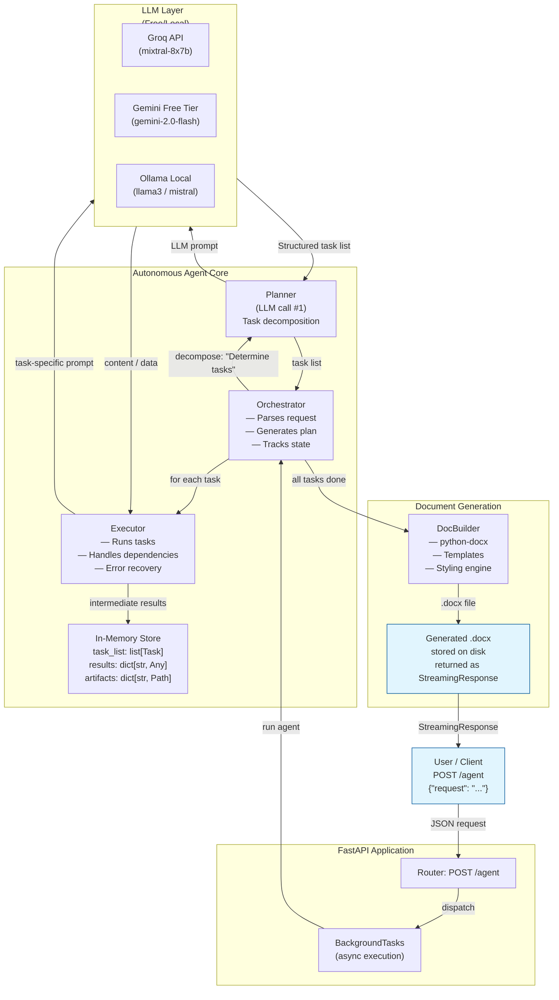
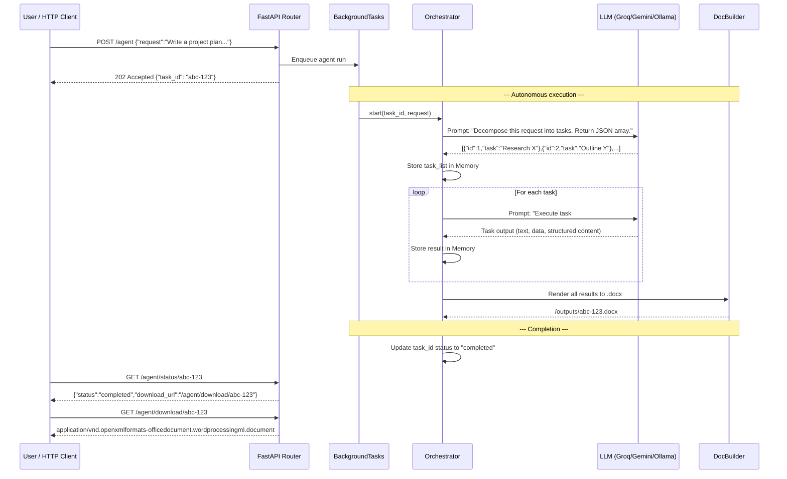
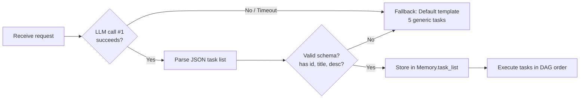
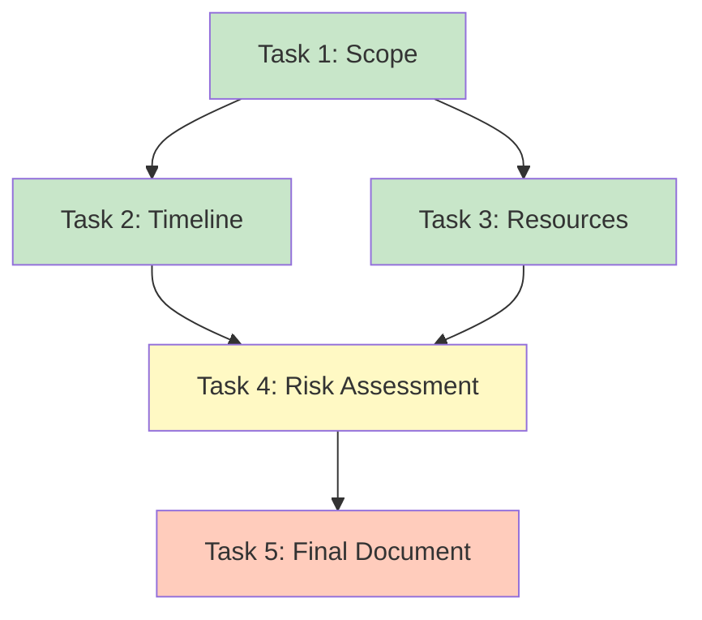
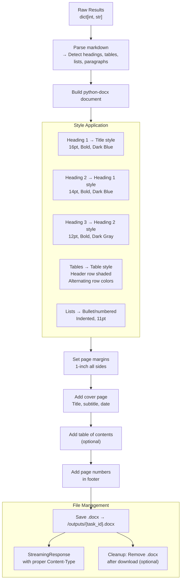
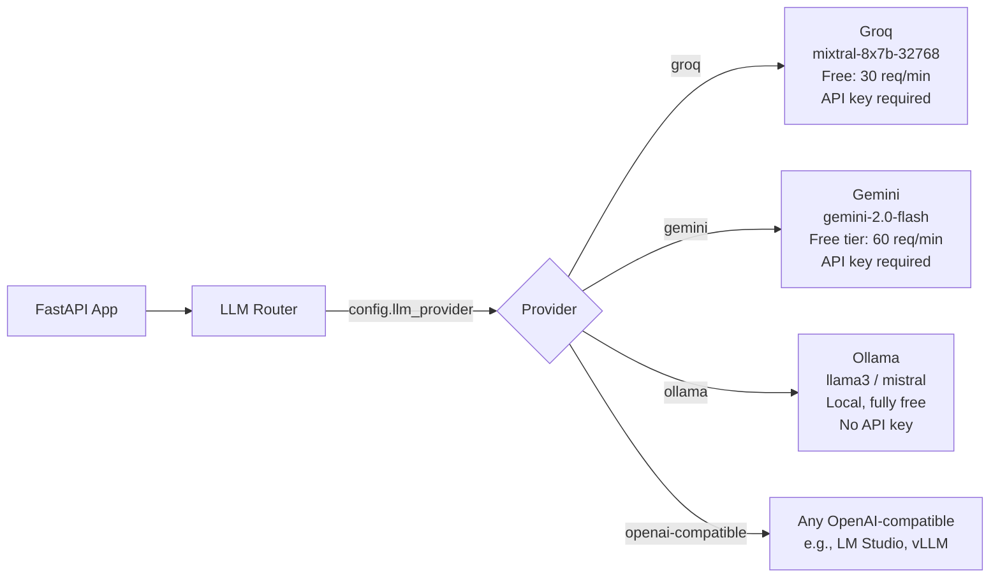
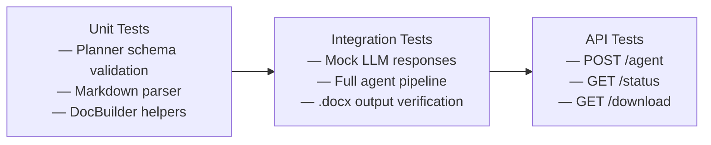

# Autonomous AI Agent — Architecture & Implementation Guide

## System Overview

A FastAPI-based autonomous agent that accepts a natural-language request, dynamically plans tasks, executes each step, and produces a polished `.docx` document. The system uses a **free / locally-runnable LLM** (e.g., Groq, Gemini free tier, or Ollama) for all reasoning and planning, and `python-docx` for document generation.

---

## High-Level Architecture



---

## Request Flow (Sequence Diagram)



---

## Planner — Task Decomposition (LLM Call #1)

### Prompt Design

```
System: You are an autonomous planning agent. Given a user request, break it down
into 3-8 sequential tasks. Each task must be concrete and executable.

Return valid JSON only — an array of objects with keys:
  - id (int)
  - title (str, <10 words)
  - description (str, 1-2 sentences describing what to produce)
  - depends_on (list[int] | null) — task IDs that must complete first

User Request: {request}

Tasks:
```

### Example LLM Response

```json
[
  {
    "id": 1,
    "title": "Define project scope",
    "description": "Write 2-3 paragraphs describing the project background, objectives, and stakeholders.",
    "depends_on": null
  },
  {
    "id": 2,
    "title": "Create milestone timeline",
    "description": "Generate a table of milestones with dates, deliverables, and owners.",
    "depends_on": [1]
  },
  {
    "id": 3,
    "title": "Draft resource requirements",
    "description": "List required personnel, tools, and budget estimates.",
    "depends_on": [1]
  },
  {
    "id": 4,
    "title": "Compile risk assessment",
    "description": "Identify top 5 risks with probability, impact, and mitigation strategies.",
    "depends_on": [2, 3]
  },
  {
    "id": 5,
    "title": "Generate final document",
    "description": "Combine all sections into a polished Word document.",
    "depends_on": [4]
  }
]
```

### Fallback / Robustness



---

## Executor — Per-Task Execution (LLM Call N)

### Dependency Resolution



### Executor Algorithm

```python
# Pseudocode
def execute_all(tasks, llm_client, max_retries=2):
    completed = {}
    while len(completed) < len(tasks):
        for task in tasks:
            if task.id in completed:
                continue
            deps_met = all(d in completed for d in (task.depends_on or []))
            if not deps_met:
                continue

            context = {d: completed[d] for d in (task.depends_on or [])}
            for attempt in range(max_retries):
                try:
                    result = llm_client.generate(
                        system="You are a business writer...",
                        prompt=build_task_prompt(task, context)
                    )
                    completed[task.id] = result
                    break
                except Exception as e:
                    if attempt == max_retries - 1:
                        completed[task.id] = f"[Error: {e}]"
    return completed
```

### Task Prompt Template

```
System: You are a professional business analyst. Produce well-structured,
detailed content for the task described. Use markdown formatting with
headings, bullet points, and tables where appropriate.

Context from previous tasks:
{context}

Task: {task_title}
{task_description}

Output:
```

---

## Document Builder — .docx Generation



### Markdown → python-docx Parsing

| Markdown Pattern | python-docx Element |
|---|---|
| `# Title` | `document.add_heading('Title', level=0)` |
| `## Section` | `document.add_heading('Section', level=1)` |
| `### Subsection` | `document.add_heading('Subsection', level=2)` |
| `- item` | `document.add_paragraph('item', style='List Bullet')` |
| `1. item` | `document.add_paragraph('item', style='List Number')` |
| `\| col1 \| col2 \|` | `document.add_table(rows, cols)` + shading |
| `**bold**` | `run.bold = True` |
| Plain text | `document.add_paragraph(text)` |

---

## API Contract

### POST /agent — Submit Request

```
Request:
POST /agent
Content-Type: application/json

{
    "request": "Create a project proposal for a mobile app that helps users track their carbon footprint. Include an executive summary, feature list, timeline, resource requirements, and risk analysis."
}

Response (202):
HTTP 202 Accepted
{
    "task_id": "a1b2c3d4-e5f6-7890-abcd-ef1234567890",
    "status": "processing",
    "message": "Agent is working on your request."
}
```

### GET /agent/status/{task_id} — Poll Status

```
Response:
{
    "task_id": "a1b2c3d4-...",
    "status": "completed",          // "processing" | "completed" | "failed"
    "tasks": [
        {"id": 1, "title": "Executive Summary", "status": "completed"},
        {"id": 2, "title": "Feature List",      "status": "completed"},
        {"id": 3, "title": "Timeline",           "status": "completed"},
        {"id": 4, "title": "Resources",          "status": "completed"},
        {"id": 5, "title": "Risk Analysis",      "status": "completed"}
    ],
    "download_url": "/agent/download/a1b2c3d4-e5f6-7890-abcd-ef1234567890"
}
```

### GET /agent/download/{task_id} — Download .docx

```
Response:
HTTP 200
Content-Type: application/vnd.openxmlformats-officedocument.wordprocessingml.document
Content-Disposition: attachment; filename="Carbon_Footprint_App_Proposal.docx"

(binary .docx stream)
```

---

## LLM Integration Details

### Supported Providers



### Abstraction Layer

```python
class LLMClient(ABC):
    @abstractmethod
    def generate(self, system: str, prompt: str, max_tokens: int = 2048) -> str: ...

class GroqClient(LLMClient): ...
class GeminiClient(LLMClient): ...
class OllamaClient(LLMClient): ...

# Selected via config
llm_client = LLMClient.create(config.LLM_PROVIDER)
```

### Configuration (`.env`)

```ini
LLM_PROVIDER=groq              # groq | gemini | ollama
GROQ_API_KEY=gsk_...
GEMINI_API_KEY=AIza...
OLLAMA_BASE_URL=http://localhost:11434
OLLAMA_MODEL=llama3
MAX_TASKS=8                   # ceiling on auto-generated tasks
OUTPUT_DIR=./outputs
```

---

## Directory Structure

```
.
├── main.py                   # FastAPI app, routes
├── config.py                 # Pydantic Settings, .env loading
├── agent/
│   ├── __init__.py
│   ├── orchestrator.py       # Core agent loop: plan → execute → build
│   ├── planner.py            # LLM prompt for task decomposition
│   ├── executor.py           # Execute individual tasks with LLM
│   └── models.py             # Task, TaskStatus, AgentResult dataclasses
├── llm/
│   ├── __init__.py
│   ├── base.py               # Abstract LLMClient
│   ├── groq_client.py        # Groq implementation
│   ├── gemini_client.py      # Google Gemini implementation
│   └── ollama_client.py      # Ollama local implementation
├── docbuilder/
│   ├── __init__.py
│   ├── builder.py            # Main docx builder
│   ├── markdown_parser.py    # Markdown → python-docx converter
│   └── styles.py             # Style constants, color schemes
├── outputs/                  # Generated .docx files
├── requirements.txt
├── .env.example
└── README.md
```

---

## Sample Output Document Structure

For a request like *"Write a project proposal for a carbon-tracking mobile app"*, the generated `.docx` might contain:

```
COVER PAGE
  Title: CarbonTrack — Mobile App Project Proposal
  Subtitle: Prepared by Autonomous AI Agent
  Date: July 10, 2026

TABLE OF CONTENTS (optional)

1. EXECUTIVE SUMMARY
   - Problem statement
   - Proposed solution
   - Expected impact

2. FEATURE LIST
   - Manual emission logging
   - Receipt scanning via OCR
   - Monthly carbon reports
   - Gamification & challenges
   - API integration with public transit

3. PROJECT TIMELINE
   | Phase | Duration | Deliverable |
   |-------|----------|-------------|
   | Discovery | 2 weeks | PRD |
   | Design | 3 weeks | Mockups |
   | Development | 8 weeks | MVP |
   | Testing | 2 weeks | QA sign-off |
   | Launch | 1 week | App Store |

4. RESOURCE REQUIREMENTS
   - Team: 1 PM, 2 iOS, 2 Android, 1 Backend, 1 Designer
   - Tools: Figma, Firebase, GitHub, Sentry
   - Budget: $120,000 (estimated)

5. RISK ASSESSMENT
   | Risk | Probability | Impact | Mitigation |
   |------|-------------|--------|------------|
   | Low adoption | High | High | Early adopter program |
   | API changes | Medium | Medium | Abstraction layer |
   | Privacy regs | Low | High | DPIA from week 1 |

6. NEXT STEPS
   - Approve proposal
   - Assemble team
   - Begin discovery phase
```

---

## Error Handling & Edge Cases

| Scenario | Behavior |
|---|---|
| LLM returns invalid JSON during planning | Retry up to 2x; fall back to default 5-task template |
| LLM times out (slow inference) | Adjustable timeout (default 30s); fallback to cached response |
| Task execution fails (3 retries exhausted) | Insert `[Error generating content]` placeholder; continue |
| Empty / nonsensical user request | Return 400 with `{"error": "Please provide a valid request"}` |
| Concurrent requests | `task_id` per request; all state isolated per task_id |
| Large document (>50 pages) | Truncate per-section content at ~2000 tokens |
| File system full | Return 500; cleanup oldest outputs on startup |

---

## Dependencies (`requirements.txt`)

```
fastapi==0.111.0
uvicorn[standard]==0.29.0
python-docx==1.1.0
pydantic-settings==2.3.0
python-multipart==0.0.9
httpx==0.27.0
groq==0.8.0
google-genai==1.0.0
ollama==0.3.0
python-dotenv==1.0.1
aiofiles==24.1.0
```

---

## Testing Strategy



- **Unit tests**: `pytest` on `planner.py`, `markdown_parser.py`, `styles.py`
- **Integration tests**: Mock `LLMClient` to return canned responses; verify the orchestrator produces expected `task_list` and `.docx` is valid
- **API tests**: `httpx.AsyncClient` against the FastAPI test app; verify status codes, content types, and polling flow
- Run: `pytest -v --cov=agent --cov=docbuilder`

---

## Deployment

```bash
# Install
pip install -r requirements.txt

# Run
uvicorn main:app --host 0.0.0.0 --port 8000

# Test
curl -X POST http://localhost:8000/agent \
  -H "Content-Type: application/json" \
  -d '{"request": "Write a meeting minutes summary for a sprint retrospective"}'

# Poll
curl http://localhost:8000/agent/status/<task_id>

# Download
curl -o output.docx http://localhost:8000/agent/download/<task_id>
```

---

## Key Design Decisions

| Decision | Rationale |
|---|---|
| **Async background execution** | Document generation can take 10-60s; returning immediately with a `task_id` avoids HTTP timeouts |
| **Polling (not WebSocket)** | Simpler to implement, sufficient for the use case, works without persistent connection |
| **Stateless per request** | Each request gets its own `task_id` and isolated memory — no cross-request contamination |
| **LLM abstraction layer** | Swap providers without touching agent logic; `.env` config for zero-code provider change |
| **Markdown as intermediate format** | LLMs excel at markdown; parsing it to docx is simpler than generating docx directly from a model |
| **Fallback planning template** | If LLM parsing fails, a hardcoded 5-task template ensures the system always produces something useful |
